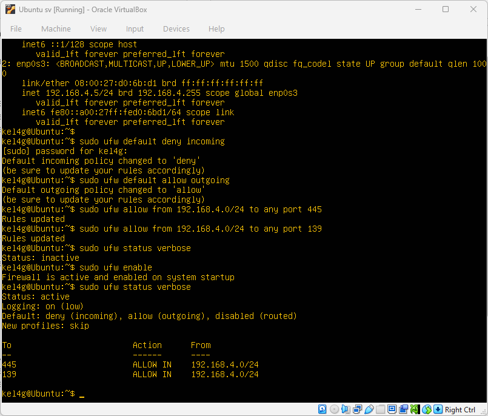
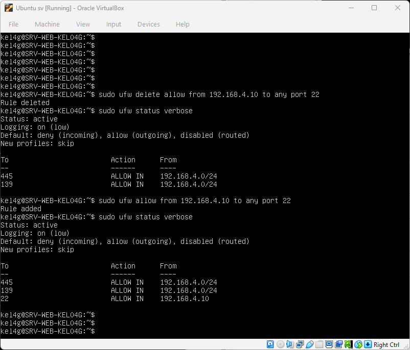
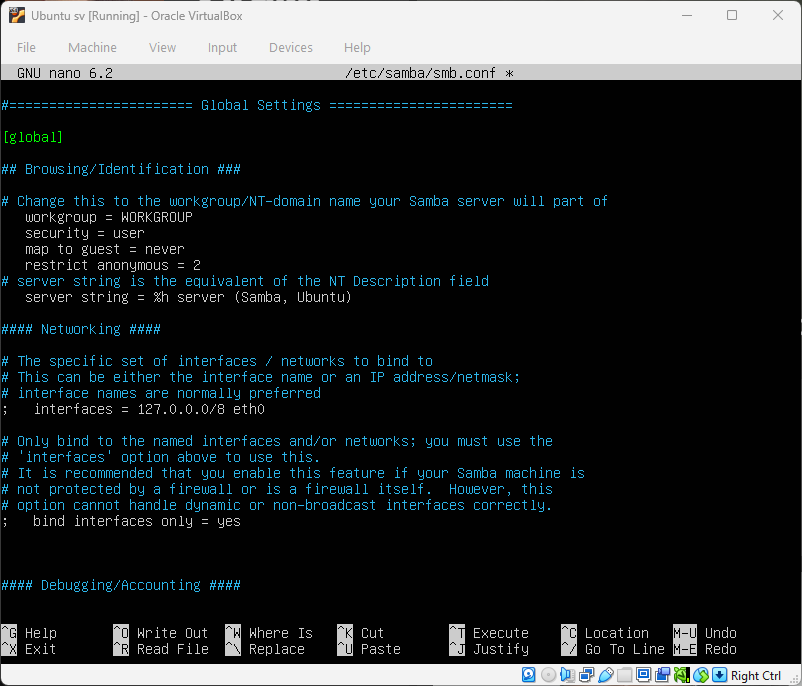
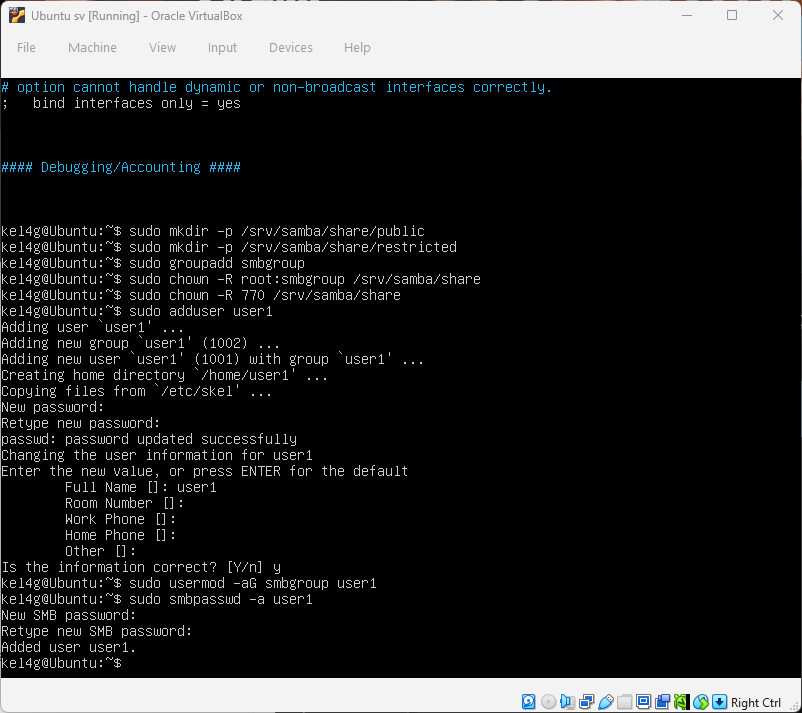
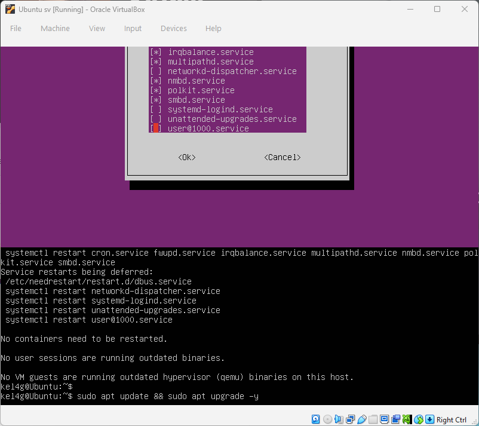
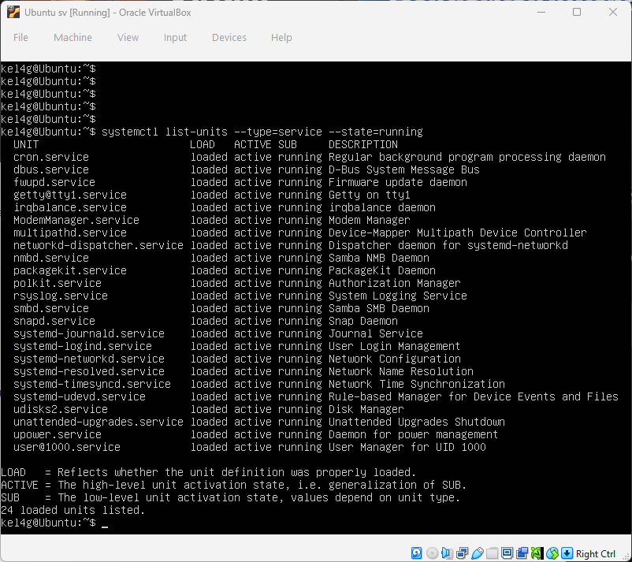
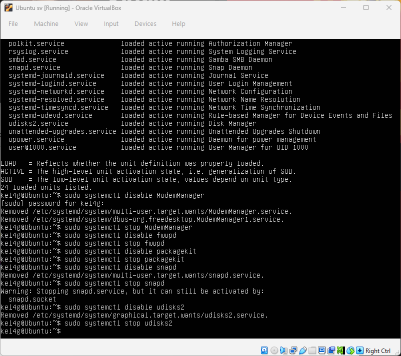
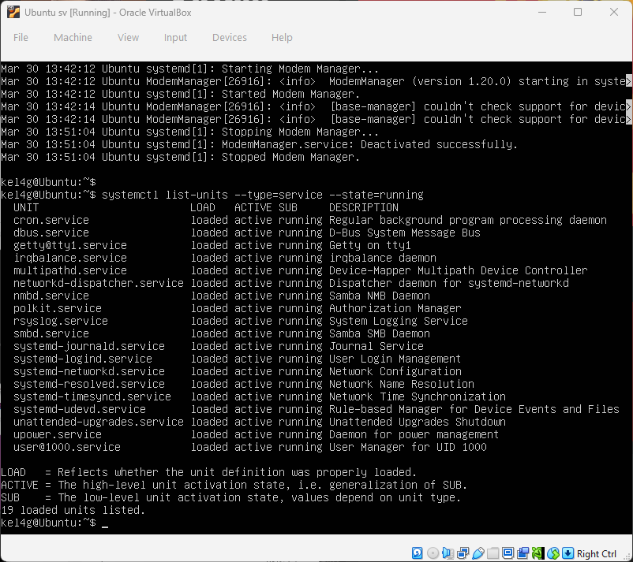
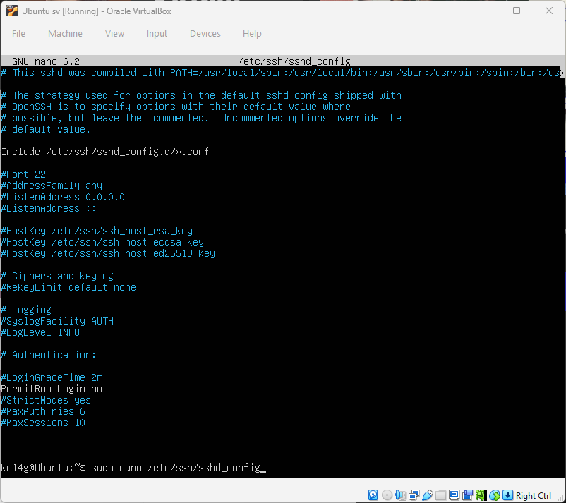
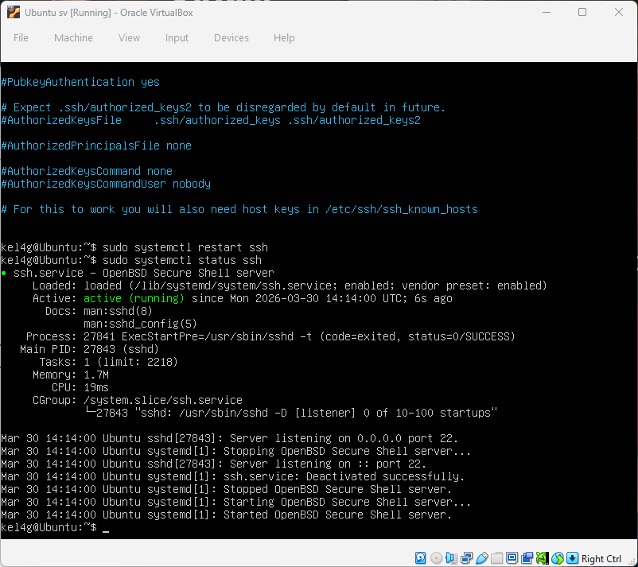

## baseline-report.md
**1. Deskripsi Topologi**

Sistem terdiri dari tiga virtual machine dalam satu jaringan:

- **Attacker Node**: Kali Linux (attacker-04) – 192.168.4.100
- **Target Server**: Ubuntu Server (fileserver-04) – 192.168.4.5
- **Monitoring Node**: Security Onion (monitor-04) – 192.168.4.10

Seluruh VM berada pada jaringan internal 192.168.4.0/24 sehingga memungkinkan simulasi serangan dan monitoring secara real-time.

---

**2. Konfigurasi Identitas Sistem**

| Hostname      | Role              | IP Address    | OS                  | Main Service | Open Ports   |
| ------------- | ----------------- | ------------- | ------------------- | ------------ | ------------ |
| attacker-04   | Attacker Node     | 192.168.4.100 | Kali Linux          | Attack Tools | -            |
| fileserver-04 | Target SMB Server | 192.168.4.5   | Ubuntu Server 22.04 | Samba (SMB)  | 445, 139, 22 |
| monitor-04    | Monitoring (SIEM) | 192.168.4.10  | Security Onion      | IDS/SIEM     | 22           |


---

**3. Network Hardening**

### 3.1 Firewall & Network Hardening

Untuk membatasi akses jaringan dan melindungi layanan SMB, dilakukan konfigurasi firewall UFW sebagai berikut:

```
sudo ufw default deny incoming
sudo ufw default allow outgoing
sudo ufw allow from 192.168.4.0/24 to any port 445
sudo ufw allow from 192.168.4.0/24 to any port 139
sudo ufw allow from 192.168.4.10 to any port 22  
sudo ufw enable
```


---

**4. System Hardening**

**4.1 Hardening Samba**

Konfigurasi file /etc/samba/smb.conf:

```
[global]
   workgroup = WORKGROUP
   security = user
   map to guest = never
   restrict anonymous = 2
```



Membuat folder share:

```
sudo mkdir -p /srv/samba/share/public
sudo mkdir -p /srv/samba/share/restricted
```

Membuat group khusus SMB:

`sudo groupadd smbgroup`

Set permission folder:

```
sudo chown -R root:smbgroup /srv/samba/share
sudo chmod -R 770 /srv/samba/share
```

Menambahkan user SMB (non-root):

```
sudo adduser user1
sudo usermod -aG smbgroup user1
sudo smbpasswd -a user1
```


Konfigurasi share di smb.conf:
```
[public]
   path = /srv/samba/share/public
   valid users = @smbgroup
   read only = yes
   browsable = yes

[restricted]
   path = /srv/samba/share/restricted
   valid users = @smbgroup
   read only = no
   browsable = yes
```
![5-add share [public] and [restricted] in smb.conf](assets/hardening/5-add-share-[public]-and-[restricted]-in-smb.conf.png)


Restart Samba:

```
sudo systemctl restart smbd
sudo systemctl status smbd
```

**4.2 Update & Patch System**

`sudo apt update && sudo apt upgrade -y`



**4.3 Nonaktifkan Service Tidak Perlu**

Cek service aktif:

`systemctl list-units --type=service --state=running`



Disable service yang tidak relevan, contoh:

```
sudo systemctl disable ModemManager
sudo systemctl stop ModemManager
```




**4.4 Hardening SSH**

Edit /etc/ssh/sshd_config:

`PermitRootLogin no`



Restart SSH:

`sudo systemctl restart ssh`



---

**5. Logging & Monitoring (Security Onion)**

Monitoring jaringan dilakukan menggunakan Security Onion (monitor-04) sebagai sensor.

Namun, pada tahap baseline ini terdapat kendala pada penggunaan dashboard IDS (Sguil), sehingga proses verifikasi logging dilakukan menggunakan tools alternatif.

**Metode monitoring yang digunakan**:

- **tcpdump** → untuk capture trafik secara langsung pada interface monitoring
- **Wireshark** → untuk analisis paket secara visual

**Hasil konfigurasi**:

- Interface monitoring pada Security Onion aktif dan dapat menangkap trafik jaringan
- Capture trafik berhasil dilakukan menggunakan tcpdump
- Analisis paket menggunakan Wireshark menunjukkan detail komunikasi antar host

---

**6. Bukti Logging**

Pengujian dilakukan dengan mengirimkan trafik ICMP dari attacker:

`ping 192.168.4.5`

Proses monitoring dilakukan pada monitor-04 menggunakan:

`sudo tcpdump -i eth1 icmp`

Hasil yang diperoleh:

- Traffic ICMP berhasil tertangkap oleh tcpdump
- Paket menunjukkan informasi:
  - Interface monitoring pada Security Onion aktif dan menangkap trafik jaringan
  - Capture berhasil dilakukan menggunakan tcpdump
  - Analisis paket dengan Wireshark menunjukkan komunikasi antar host

Selain itu, file capture dapat dianalisis menggunakan Wireshark untuk melihat detail paket secara lebih lengkap.

Bukti visual berupa screenshot hasil tcpdump dan Wireshark:

/tcpdump-log-icmp.png)
/Wireshark-log-icmp.png)

---

**7. Kesimpulan Baseline**

Berdasarkan implementasi hardening dan monitoring:

1. Network Security: Firewall membatasi akses hanya untuk port penting (SMB & SSH) dari subnet internal, meminimalkan risiko akses tidak sah.
2. System Security: Samba, SSH, dan service lain telah dikonfigurasi sesuai praktik hardening dasar. Update sistem dilakukan untuk menutup celah keamanan.
3. Monitoring: Security Onion berhasil menangkap dan menampilkan trafik ICMP dari attacker ke target, membuktikan kemampuan logging jaringan.
4. Kesiapan Baseline: Infrastruktur siap untuk fase selanjutnya (deteksi serangan simulasi ransomware), karena sistem dan jaringan telah dibatasi, dan monitoring dapat diverifikasi.
