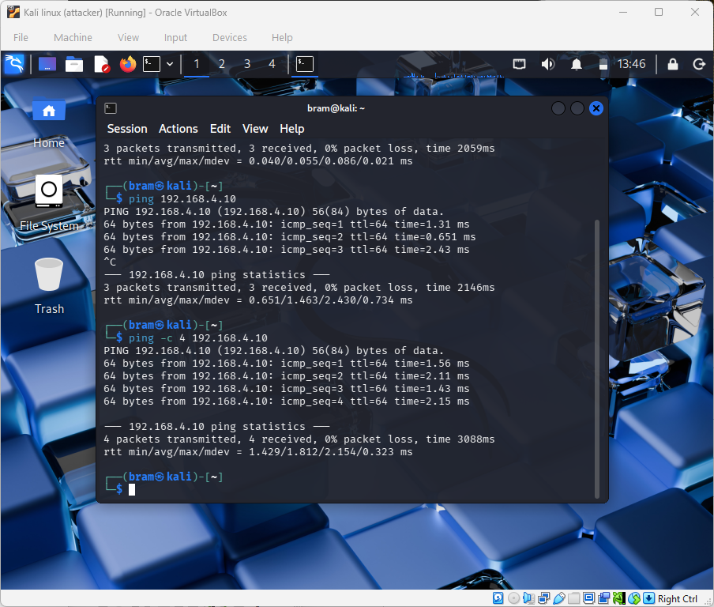
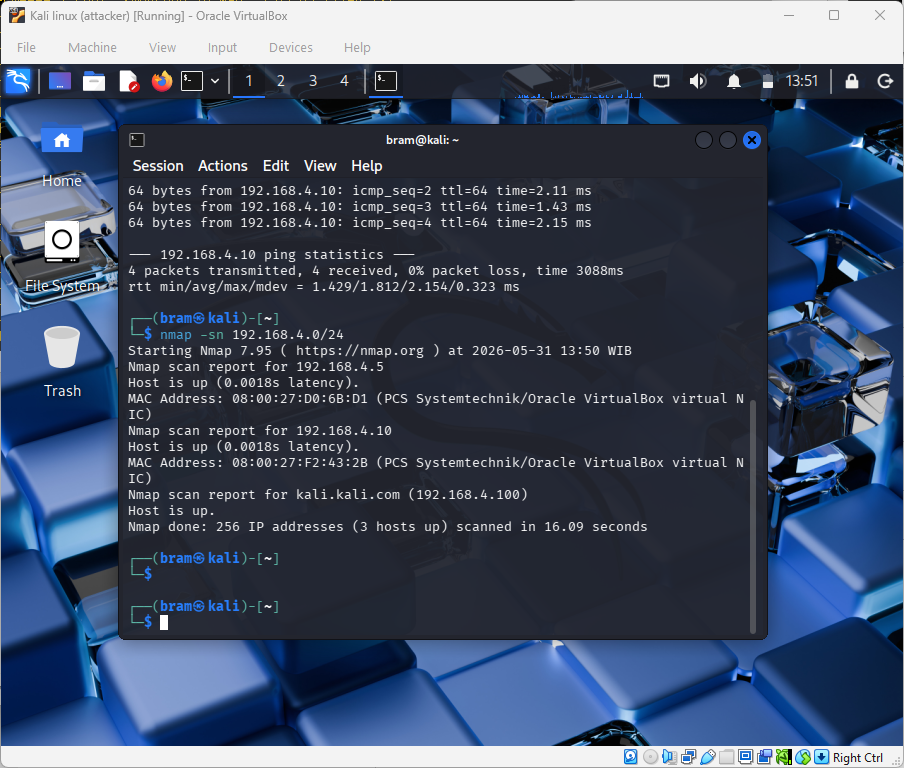
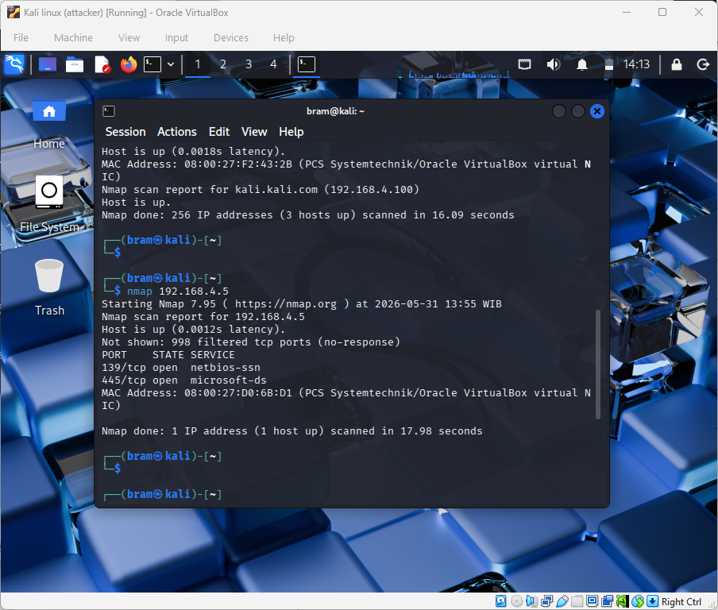
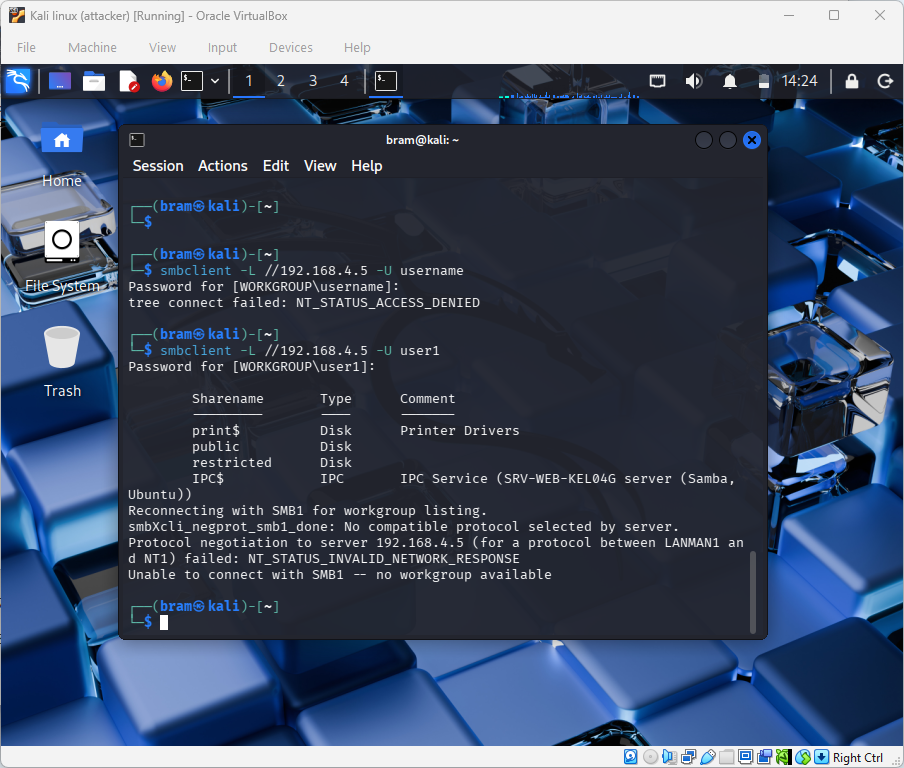
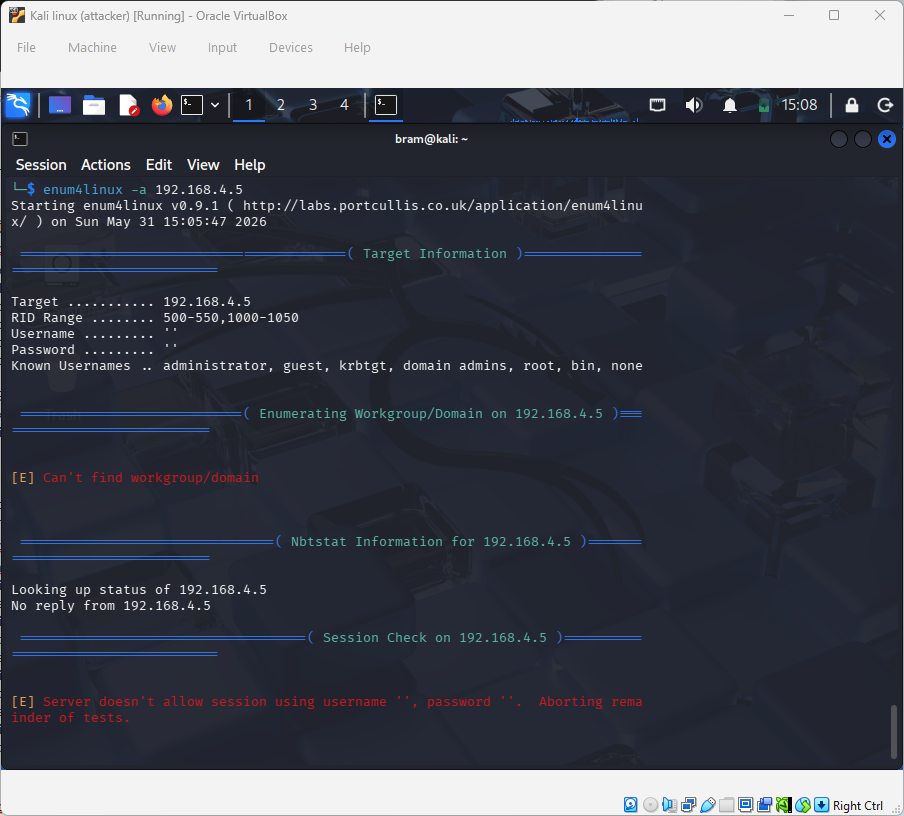

# Vulnerability Assessment Report


## 1. Assessment Overview


Assessment dilakukan dari mesin Kali Linux terhadap Ubuntu Samba File Server pada jaringan internal. Tujuan assessment adalah mengidentifikasi layanan yang tersedia, mekanisme akses file sharing, serta potensi penyalahgunaan akses yang dapat dimanfaatkan oleh attacker internal dalam skenario simulasi ransomware.


Target Server : 192.168.4.5


---


## 2. Verifikasi Konektivitas



### Command


```

ping -c 4 192.168.4.5

```


### Hasil


Seluruh paket ICMP berhasil diterima tanpa packet loss.


### Analisis


Target dapat dijangkau dari mesin attacker sehingga komunikasi jaringan dan proses assessment dapat dilakukan.


---


## 3. Host Discovery



### Command


```bash

nmap -sn 192.168.4.0/24

```


### Hasil


Host aktif yang terdeteksi:


| IP Address    | Keterangan               |
| ------------- | ------------------------ |
| 192.168.4.5   | Ubuntu Samba File Server |
| 192.168.4.10  | Security Onion           |
| 192.168.4.100 | Kali Linux               |


### Analisis


Host discovery berhasil mengidentifikasi perangkat yang aktif pada jaringan internal dan menemukan target server yang akan digunakan pada tahap assessment berikutnya.


---


## 4. Basic Port Scan



### Command


```bash

nmap 192.168.4.5

```


### Hasil


| Port    | State | Service                 |
| ------- | ----- | ----------------------- |
| 139/tcp | Open  | NetBIOS Session Service |
| 445/tcp | Open  | SMB                     |


### Analisis


Layanan SMB terdeteksi aktif pada target dan menjadi jalur utama yang memungkinkan akses terhadap file sharing server.


---


## 5. Service Version Detection


### Command


```bash

nmap -sV 192.168.4.5

```


### Hasil


| Port    | Service      |
| ------- | ------------ |
| 139/tcp | Samba smbd 4 |
| 445/tcp | Samba smbd 4 |


### Analisis


Target menggunakan layanan Samba sebagai file sharing server. Service ini berpotensi dimanfaatkan oleh attacker yang memiliki kredensial valid untuk mengakses dan memodifikasi file pada shared folder.


---


## 6. SMB Enumeration



### Command


```bash

smbclient -L //192.168.4.5 -U user1

```


### Hasil


Share yang berhasil diidentifikasi:


| Share Name |
| ---------- |
| public     |
| restricted |
| print$     |
| IPC$       |


### Analisis


Attacker berhasil mengidentifikasi resource yang tersedia pada server. Informasi ini dapat digunakan untuk menentukan lokasi penyimpanan file yang berpotensi menjadi target serangan.


---


## 7. Anonymous Access Assessment



### Command


```bash

enum4linux -a 192.168.4.5

```


### Hasil


Anonymous session ditolak oleh server dan proses enumerasi tidak dapat dilanjutkan.


### Analisis


Server berhasil membatasi akses anonim sehingga informasi sensitif tidak dapat diperoleh tanpa autentikasi. Hasil ini menunjukkan bahwa konfigurasi hardening SMB telah diterapkan dengan baik.


---


## 8. SMB Script Assessment

-Nmap-SMB-script.png)
-Nmap-SMB-script.png)

### Command


```bash

nmap --script smb-os-discovery 192.168.4.5


nmap --script smb-protocols 192.168.4.5


nmap --script smb-enum-shares 192.168.4.5

```


### Hasil


Script smb-protocols berhasil mengidentifikasi protokol yang didukung:


* SMB 2.1

* SMB 3.0

* SMB 3.0.2

* SMB 3.1.1


Script smb-os-discovery dan smb-enum-shares tidak menghasilkan informasi tambahan.


### Analisis


Server hanya mendukung SMB versi 2 dan 3, sementara SMBv1 tidak ditemukan. Hal ini menunjukkan bahwa hardening protokol SMB telah diterapkan. Keterbatasan informasi yang diperoleh dari script Nmap juga mengindikasikan bahwa proses enumerasi otomatis dibatasi oleh konfigurasi keamanan server.


---


## 9. Security Observations


Berdasarkan assessment yang dilakukan, ditemukan beberapa kondisi keamanan sebagai berikut:


* SMBv1 tidak aktif.

* Anonymous SMB enumeration diblok.

* Akses share memerlukan autentikasi pengguna.

* Share SMB dapat diidentifikasi oleh pengguna yang memiliki kredensial valid.


---


## 10. Attack Feasibility Assessment


Meskipun beberapa mekanisme hardening telah diterapkan, pengguna yang memiliki kredensial SMB yang sah masih dapat mengakses shared folder yang tersedia. Kondisi ini memungkinkan attacker internal yang berhasil memperoleh kredensial untuk melakukan aktivitas seperti:


* Bulk file modification.

* Bulk file renaming.

* Bulk file deletion.

* Simulasi ransomware melalui SMB share.


Temuan ini sesuai dengan skenario ancaman internal compromised endpoint yang digunakan dalam proyek Data Integrity Shield.


---


## 11. Conclusion


Hasil vulnerability assessment menunjukkan bahwa target telah menerapkan beberapa kontrol keamanan yang efektif terhadap enumerasi SMB dan akses anonim. Namun, layanan SMB tetap dapat diakses oleh pengguna yang memiliki kredensial valid. Oleh karena itu, akses yang berhasil dikompromikan masih berpotensi digunakan untuk melakukan aktivitas destruktif terhadap file pada shared folder dan menjadi dasar untuk tahap simulasi ransomware pada fase berikutnya.


